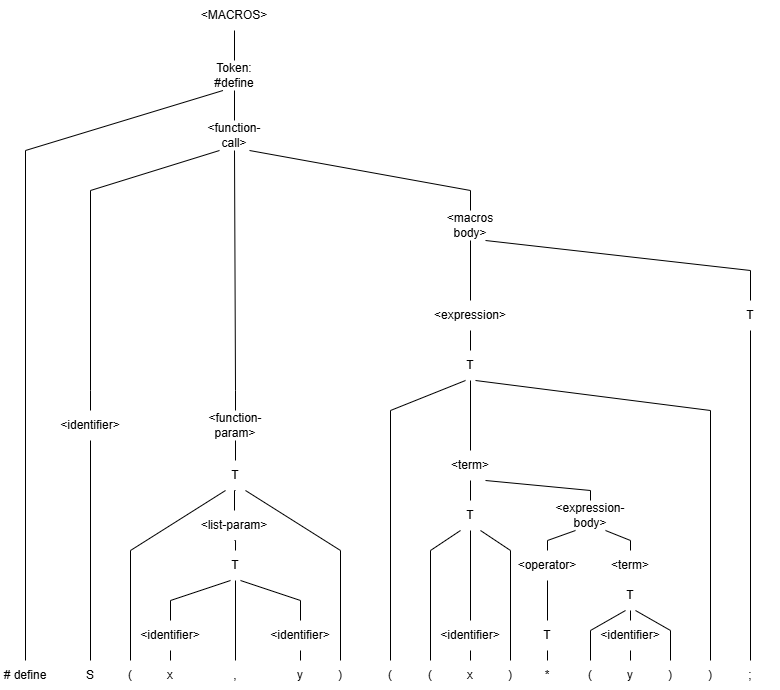

# Лабораторная работа 5. Построение AST и проверка контекстно-зависимых условий
## Сведения об авторе
Работу выполнила студентка группы АВТ-314, Парамонова К.Ф.

## Контекстно-зависимые условия:
### Уникальность идентификаторов
Пример: #define S(x, x) (x + 1);  
Ожидаемое сообщение: "Одинаковые параметры в аргументах"  

### Использование идентификаторов
Пример: #define S() (x + 1);  
Ожидаемое сообщение: "Неизвестный аргумент: x"  

## Структура AST:
### Описание типов узлов

### Рисунок AST для верной строки в любом графическом редакторе
  

### Формат вывода AST в программе

## Тестовые примеры (скриншоты)
### Уникальность идентификаторов
  

### Использование идентификаторов
  

## Инструкция по сборке и запуску:
### Путь к готовому исполняемому файлу
./tflc_1/bin/Release/tflc_1.exe