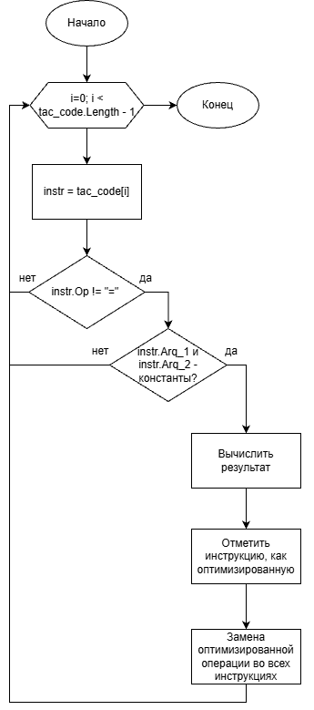
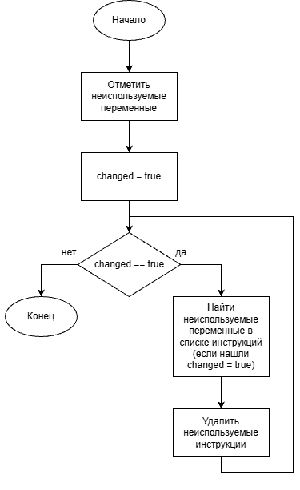

# Лабораторная работа 7. Анализ и преобразование кода с использованием Clang и LLVM
## Сведения об авторе
Работу выполнила студентка группы АВТ-314, Парамонова К.Ф.

## Постановка задачи
### Общее задание
Необходимо выполнить следующие шаги:  
1. Установка среды  
Установить Clang, LLVM, opt и Graphviz (например, в Ubuntu 26.04).  
2. Работа с AST  
Сгенерировать абстрактное синтаксическое дерево для заданного C/C++‑файла.  
3. Генерация LLVM IR  
Получить промежуточное представление кода без оптимизаций (-O0) и с оптимизациями (-O2).  
4. Оптимизация IR  
Применить оптимизации с помощью opt и/или флагов Clang, сравнить изменения.  
5. Построение CFG  
Построить граф потока управления для одной или нескольких функций.  
6. Выводы  
Ответить на контрольные вопросы  

### Индивидуальное задание (макросы с параметрами)
Пример кода:  
#define SQUARE(x) ((x) * (x))  
int main() {  
int a = 5;  
int b = SQUARE(a + 1);  
return b;  
}  
  
Задания:  
1. Постройте AST. Укажите, виден ли макрос?  
2. Получите IR для -O0.  
3. Получите IR для -O2. Вычислено ли выражение на этапе компиляции?  
4. Постройте CFG.  
5. Сделайте вывод: отличие макроса от inline-функции (задание 2.10.1) в IR  

## Общее задание
Выполнение общего задания представлено в pdf-файле "1 часть"

## Индивидуальное задание
Выполнение индивидуального задания представлено в pdf-файле "2 часть"

## Выводы
Ответы на контрольные вопросы представлены в pdf-файле "3 - ответы на вопросы"

# Дополнительное задание
## Оптимизация 1 - свёрстка констант
### Текстовое описание
Свёртка констант — это оптимизация, которая вычисляет выражения с константными операндами на этапе компиляции вместо выполнения их во время работы программы.

### Обощённая блок-схема

## Оптимизация 2 - свёрстка констант
### Текстовое описание
Удаление мёртвого кода — это оптимизация, которая удаляет инструкции, результат которых никогда не используется в программе.

### Обощённая блок-схема

## Тестовые примеры
  
  
