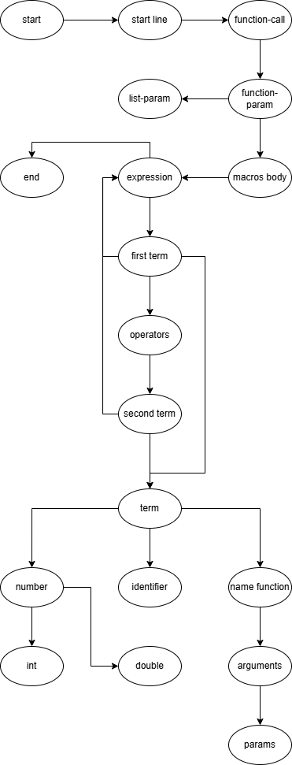
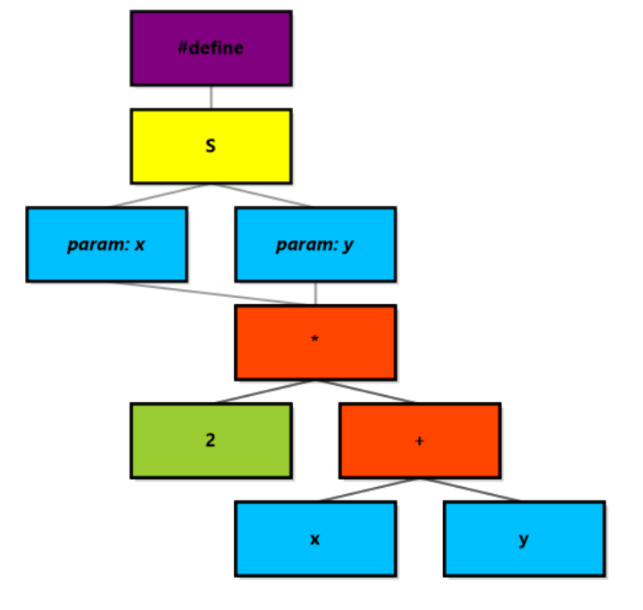
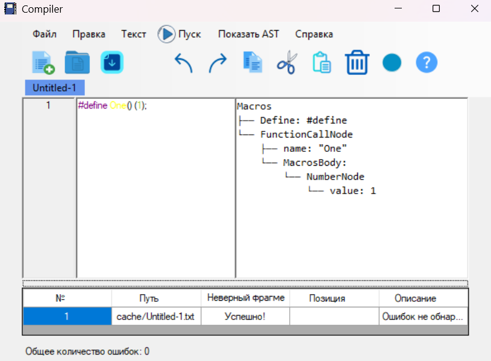
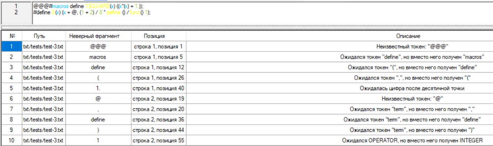
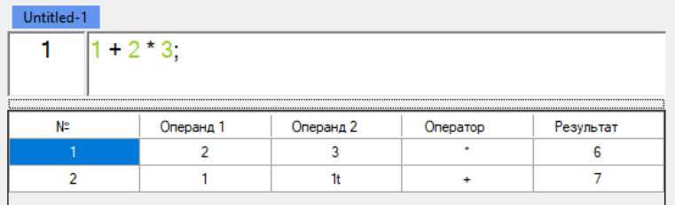
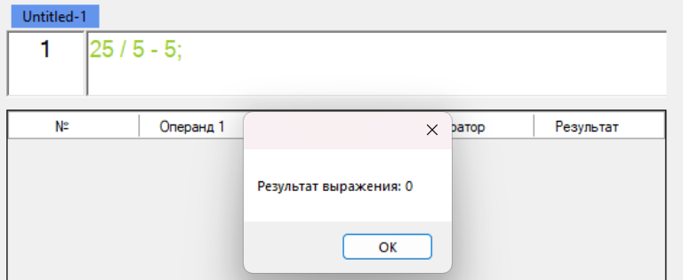
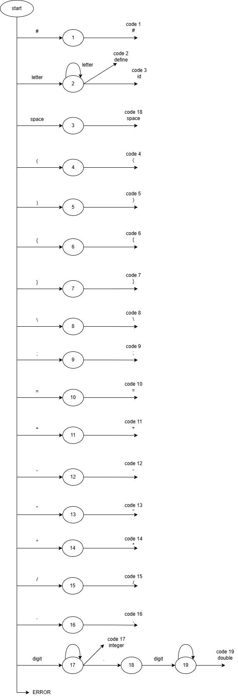

# Лабораторная работа 3. Разработка синтаксического анализатора (парсера)
## Цель работы
Изучить назначение и принципы работы синтаксического анализатора в структуре компилятора. Спроектировать грамматику, построить соответствующую схему метода анализа грамматики и выполнить программную реализацию парсера с нейтрализацией синтаксических ошибок методом Айронса. Интегрировать разработанный модуль в ранее созданный графический интерфейс языкового процессора.

## Сведения об авторе
Работу выполнила студентка группы АВТ-314, Парамонова К.Ф.

## Постановка задачи:
Разработать синтаксический анализатор (парсер) в соответствии с индивидуальным вариантом курсовой (расчетно-графической) работы, интегрировать его в приложение из лабораторной работы №1 и обеспечить наглядный вывод результатов анализа.

## Вариант задания:
### Номер варианта:
80, Макрос с параметрами на языке C  

### Корректные входные строки:  
1. #define SQUARE(x) ((x)*(x));
2. #define ADDITIVE(a, b) (a + b);

### Перечень допустимых лексем: 
1. Буква(ы)
2. Ключевое слово define
3. Идентификатор
4. Левая круглая скобка "("
5. Правая круглая скобка ")"
6. Точка с запятой ";"
7. Знак равенства "="
8. Плюс "+"
9. Минус "-"
10. Знак умножения "*"
11. Знак деления "/"
12. Запятая ","
13. Целочисленное число
14. Пробел
15. Вещественное число

## Разработка грамматики:
	1. <start> ::= “#” “define” <function-call> <macros body> “;”
 
	2.	<function-call> ::= <identifier> <functions-param>
	3.	<functions-param> ::= “(“ <list-param> “)”
	4.	<list-param> ::= <identifier> <parameters> | ε
	5.	<parameters> ::=  “,” <identifier> <parameters> | ε
 
	6.	<macros body> ::= “(“ <expression> “)”
	7.	<expression> ::= <term> <expression-body>
	8.	<expression-body> ::= <operators> <term> <expression-body> | ε
 
	9.	<term> ::= 
		<identifier> 
		| <number> 
		| <function-call> 
		| “(“ <expression> “)” 
 
	10.	<identifier> ::= <letter> <identifier-body>
	11.	<identifier-body> ::= 
		<letter> <identifier-body> 
		| <digit> <identifier-body>  
		| “_” <identifier-body> 
		| ε 
 
	12.	<number> ::= <integer> | <double>
	13.	<integer> ::= <digit-without-0> <int> | “0”
	14.	<int> ::= <digit> <int> | ε
	15.	<double> ::= <int> “.” <int>
	
	16.	<letter> ::= “a” | “b” | “c” | “d” | “e” | “f” | “g” | “h” | “i” | “j” | “k” | “l” 
			| “m” | “n” | “o” | “p” | “q” | “r” | “s” | “t” | “u” | “v” | “w” | “x” 
			| “y” | “z” | “A” | “B” | “C” | “D” | “E” | “F” | “G” | “H” | “I” 
			| “J” | “K” | “L” | “M” | “N” | “O” | “P” | “Q” | “R” | “S” | “T” 
			| “U” | “V” | “W” | “X” | “Y” | “Z”
	
	17.	<digit-without-0> ::= “1” | “2” | “3” | “4” | “5” | “6” | “7” | “8” | “9”
	18.	<digit> ::= “0” | “1” | “2” | “3” | “4” | “5” | “6” | “7” | “8” | “9”
	
	19.	<operators> ::= “=” | “+” | “-“ | “*” | “/”

## Классификация грамматики (по Хомскому):
Контекстно-свободная грамматика

## Метод анализа:
Рекурсивный спуск:  

## Диагностика и нейтрализация синтаксических ошибок:
В данной реализации синтаксического анализатора нейтрализация ошибок выполняется по методу Айронса.  
  
При обнаружении лексемы, не соответствующей ожидаемой грамматике, анализатор переходит в режим пропуска лексем. Пропуск идёт с ошибочного токена и продолжается до тех пор, пока не встретится "правильная" лексема, после чего работа парсера продолжается, как было до этого.  
  
"Правильная" лексема - следующий корректный токен, который должен быть после ошибочного.  
  
При этом учитывается логическое окончание части строки. То есть, если, например есть такая строка: "#define ) (x);", то, не найдя имя функции, парсер начнёт искать "(". Но раньше ему попадётся ")", и парсер поймёт, что логическая часть "function-call" окончена и надо переходить в тело макроса. А дальше он спокойно будет парсить тело марокса.  
  
Таких логических частей несколько. Они отображены в первой строке грамматики:  
	<start> ::= “#” “define” <function-call> <macros body> “;”  
  
Если парсер поймёт, что логическая часть, в которой он сейчас находится окончена, то он перейдёт на парсинг следующей.  
Если пропущено несколько логических частей подряд (например, "#" и "define"), то синтаксический анализатор сообщит об отсуствии первой логической части (то есть, об "#"), а о второй умолчит, ибо пропускает лексемы до первой "правильной".  
  
Если встречается символ ";", то парсинг строки прекращается и начинается парсинг следующей строки.  
  
Пример:  
#macros () (1 + 1);  
Пропущен "define". Парсер доходит до токена "macros" и сообщает, что define пропущен. Начинает пропускать лексемы, начиная с ошибочной, до корректной. Однако ошибочная лексема "macros" является следующей корректной лексемой - именем функции, поэтому синтаксический анализатор парсит macros, как имя функции, и продолжает работать, как раньше.  

## Тестовые примеры:
Хорошие строки  
  
  
Строки с одной ошибкой (скобки)  
  
  
Несколько ошибок  
  
  
Не хватает одного токена
  
  
Точка с запятой
  

# Лабораторная работа 2. Разработка лексического анализатора (сканера)
## Цель работы
Изучить назначение и принципы работы лексического анализатора в структуре компилятора. Спроектировать алгоритм (диаграмму состояний) и выполнить программную реализацию сканера для выделения лексем из входного текста. Интегрировать разработанный модуль в ранее созданный графический интерфейс языкового процессора.

## Сведения об авторе
Работу выполнила студентка группы АВТ-314, Парамонова К.Ф.

## Постановка задачи:
Разработать лексический анализатор (сканер) в соответствии с индивидуальным вариантом задания, интегрировать его в приложение из лабораторной работы №1 и обеспечить наглядный вывод результатов.

## Вариант задания:
### Номер варианта:
80, Макрос с параметрами на языке C  

### Корректные входные строки:  
1. #define SQUARE(x) ((x)*(x));
2. #define ADDITIVE(a, b) (a + b);

### Перечень допустимых лексем: 
1. Буква(ы)
2. Ключевое слово define
3. Идентификатор
4. Левая круглая скобка "("
5. Правая круглая скобка ")"
6. Точка с запятой ";"
7. Знак равенства "="
8. Плюс "+"
9. Минус "-"
10. Знак умножения "*"
11. Знак деления "/"
12. Запятая ","
13. Целочисленное число
14. Пробел
15. Вещественное число

## Диаграмма состояний:
### Изображение спроектированного конечного автомата:

### Краткое описание работы автомата:
Посимвольно читает строку, ища соответствие пришедшего символа и допустимых лексем. Если пришло число или идентификатор, то читает символы до первого пробела или ";". Для вещественного числа ожидает после знака "." число.

## Тестовые примеры:
#define SQUARE(x) ((x)*(x))  

  
1.4 + 1. = 2.8e56  

  
#define MAX 50  
@aboba2  

  
  
  
  
  
# Лабораторная работа 1. Разработка пользовательского интерфейса (GUI) для языкового процессора
## Цель работы
Создание кроссплатформенного графического интерфейса (GUI) для языкового процессора в виде специализированного текстового редактора.

## Сведения об авторе
Работу выполнила студентка группы АВТ-314, Парамонова К.Ф.

## Описание проекта:
В ходе работы был реализован текстовый редактор, основные функции которого включают:

1. Возможность работать с несколькими текстовыми файлами

2. Написание текста в специальном текстовом окне с функциеями подсветки синтаксиса и нумерацией строк

3. Вывод ошибок в табличном виде в окне ниже

4. Работу с файлами:
- Создание файла
- Открытие файла
- Сохранение файла
- Сохранение как файла

5. Работу со правкой, включающую в себя стандартную работу с текстом:
- Отмену
- Повтор
- Вырезание
- Копирование
- Вставку
- Удаление
- Выделение всего текста

6. Справку, содержащую информацию "О программе"

7. Окно выхода, возникающее при закрытии приложения, если данные в каком-либо файле не были сохранены

## Используемые технологии:
Язык программирования: С#;  
Фреймворк для GUI: WinForms;  
Среда разработки: Visual Studio

## Инструкция по сборке и запуску:
### Путь к готовому исполняемому файлу
./tflc_1/bin/Release/tflc_1.exe

## Описание интерфейса и функций (руководство пользователя):
https://docs.google.com/document/d/1fWNk5rWH6WQS7mHoRATFV-HjUk_kn4-cbsnOeN8V2jE/edit?tab=t.0
