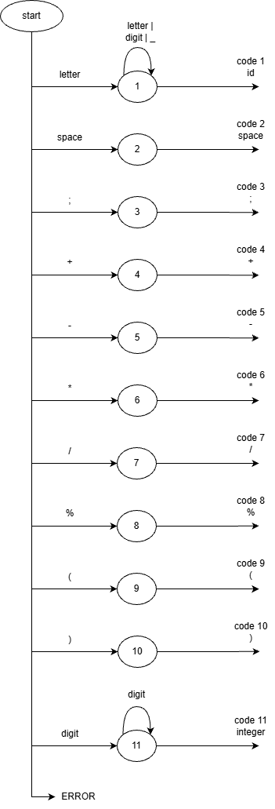
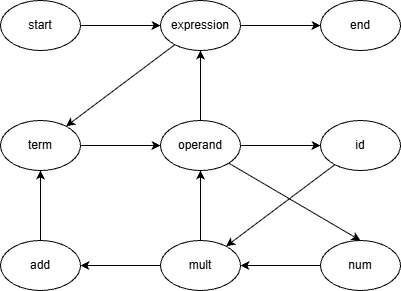

# Лабораторная работа 6. Создание внутренней формы представления программы
## Сведения об авторе
Работу выполнила студентка группы АВТ-314, Парамонова К.Ф.

## Вариант задания
### Язык программирования
C / C++

### Определение КС-грамматики
	1. <expression> → <term> <add>
	2. <add> → ε | + <term> <add> | - <term> <add>
	3. <term> → <operand> <mult>
	4. <mult> → ε | * <operand> <mult> | / <operand> <mult> | % <operand> <mult>
	5. <operand> → <num> | <id> | ( <expression> )
	6. <id> → letter {letter | digit | _}
	7. <num> → digit-0 {digit}

	letter → a..z A..Z
	digit → 0 | 1 | 2 | 3 | 4 | 5 | 6 | 7 | 8 | 9
	digit-0 → 1 | 2 | 3 | 4 | 5 | 6 | 7 | 8 | 9

### Корректные входные строки
1. 1 + 2 * 3;
2. 25 / 5 - 5;

## Лексические и синтаксические ошибки
### Диаграмма лексера
  

### Схема рекурсивного спуска
 

### Тестовые примеры работы лексера

### Тестовые примеры работы парсера

## Внутренняя форма представления программы (тетрады)

## ПОЛИЗ