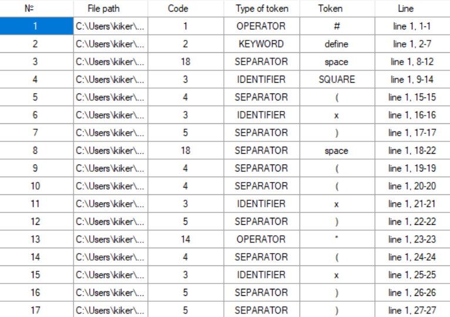
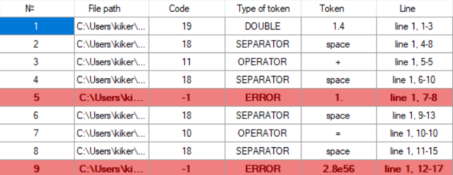
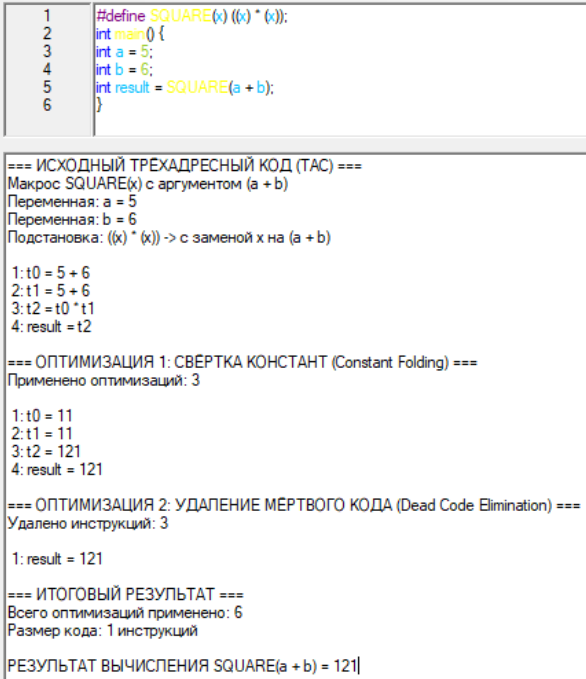

# Лабораторная работа 4. Реализация алгоритма поиска подстрок с помощью регулярных выражений
## Цель работы
Изучить теоретические основы регулярных выражений и их применение для поиска и извлечения подстрок из текста. Освоить практические навыки использования библиотечных средств работы с регулярными выражениями, а также интеграцию алгоритмов поиска в графический интерфейс приложения.

## Сведения об авторе
Работу выполнила студентка группы АВТ-314, Парамонова К.Ф.

## Постановка задачи:
Разработать модуль поиска подстрок с использованием регулярных выражений, интегрировать его в существующее приложение (текстовый редактор) и обеспечить наглядный вывод результатов.

## Вариант задания:
6, Построить РВ, описывающее шестнадцатеричный код (HEX) цвета (длиной 6).  
27, Построить РВ, описывающее все виды комментариев (язык Python).  
4, Построить РВ, описывающее MAC-адрес.  

## Решение 3 задач:
### 1. Шестнадцатеричный код (HEX) цвета:
#### Описание задачи
Построить РВ, описывающее шестнадцатеричный код (HEX) цвета (длиной 6).

#### Регулярное выражение с пояснением каждого обозначения
#[\dA-F]{6}, где  
\# - символ вначале,  
\d - десятичная цифра,  
A-F - буквы от A до F (нестнадцатеричная система),  
[\dA-F] - либо одна цифра, либо одна буква,  
[\dA-F]{6} - повторение условия 6 раз.  

#### Примеры строк, которые должны находиться
#FF12AA  
#FF1201  
#FA89BA  

#### Примеры строк, которые не должны находиться
#FFHA12  
#F3A  
FA89BA  

#### Тестовые примеры

### 2. Комментарии (Python):
#### Описание задачи
Построить РВ, описывающее все виды комментариев (язык Python).

#### Регулярное выражение с пояснением каждого обозначения
(#.*$)|("{3}.*?"{3}|'{3}.*?'{3}), где  
\# - символ вначале одиночного комментария,  
"{3} - двойная кавычка повторяется 3 раза,  
'{3} - одинарная кавычка повторяется 3 раза,  
. - любой одиночный символ,  
\* - предыдущий символ повторяется 0 и более раз,  
$ - конец строки,  
? - предыдущий символ повторяется 0 или 1 раз,  
.*$ - любые символы идут до конца строки,  
.*? - любые символы идут до закрывающих кавычек,  
| - вариация комментариев.  

#### Примеры строк, которые должны находиться
#aboba123  
'''aboba123'''  
"""aboba123"""  

#### Примеры строк, которые не должны находиться
aboba  
"""aboba'''  
'''aboba"""  

#### Тестовые примеры (скриншоты)

### 3. MAC-адрес:
#### Описание задачи
Построить РВ, описывающее MAC-адрес.

#### Регулярное выражение с пояснением каждого обозначения
([\dA-F]{2}:){5}[\dA-F]{2}$  
\d - десятичная цифра,  
A-F - буквы от A до F (нестнадцатеричная система),  
[\dA-F] - либо одна цифра, либо одна буква,  
[\dA-F]{2} - 2 символа должно быть между ":",  
: - разделяющее двоеточие,  
([\dA-F]{2}:){5} - 5 раз повторяется конструкция "HEXHEX:",  
$ - конец строки,  
[\dA-F]{2}$ - в конце двоеточия нет, поэтому прописано отдельно.  

#### Примеры строк, которые должны находиться
AA:BB:CC:DD:EE:FF  
12:34:56:78:12:01  
A1:7B:CC:90:8E:0F  

#### Примеры строк, которые не должны находиться
00:1B:44:11:3A:G7  
00:1B:44:11:3A  
0:1B:44:11:3A:7C  

#### Тестовые примеры (скриншоты)
